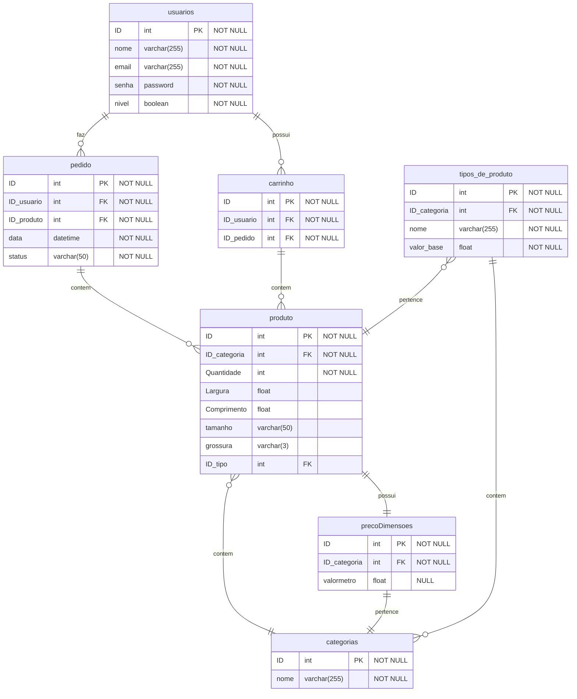

```mermaid
erDiagram
usuarios ||--o{ carrinho : possui
usuarios ||--o{ pedido : faz
pedido ||--o{ produto : contem
carrinho ||--o{ produto : contem
categorias ||--o{ produto : contem
produto ||--|| precoDimensoes : possui
precoDimensoes ||--|| categorias : pertence
tipos_de_produto ||--o{ categorias : contem
tipos_de_produto }o--|| produto : pertence


usuarios {
    ID int PK "NOT NULL"
    nome varchar(255) "NOT NULL"
    email varchar(255) "NOT NULL"
    senha password "NOT NULL"
    nivel boolean "NOT NULL"
}

categorias {
    ID int PK "NOT NULL"
    nome varchar(255) "NOT NULL"
}

produto {
    ID int PK "NOT NULL"
    ID_categoria int FK "NOT NULL"
    Quantidade int "NOT NULL"
    Largura float
    Comprimento float
    tamanho varchar(50)
    grossura varchar(3)
    ID_tipo int FK
}

pedido {
    ID int PK "NOT NULL"
    ID_usuario int FK "NOT NULL"
    ID_produto int FK "NOT NULL"
    data datetime "NOT NULL"
    status varchar(50) "NOT NULL"
}

carrinho {
    ID int PK "NOT NULL"
    ID_usuario int FK "NOT NULL"
    ID_pedido int FK "NOT NULL"
}

precoDimensoes {
    ID int PK "NOT NULL"
    ID_categoria int FK "NOT NULL"
    valormetro float "NULL"
}

tipos_de_produto {
    ID int PK "NOT NULL"
    ID_categoria int FK "NOT NULL"
    nome varchar(255) "NOT NULL"
    valor_base float "NOT NULL"
}
```